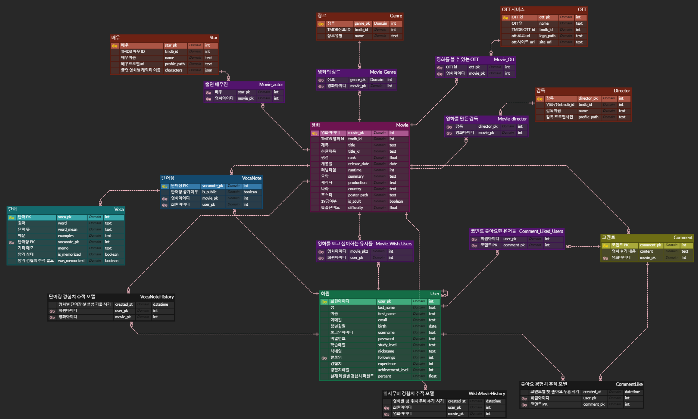
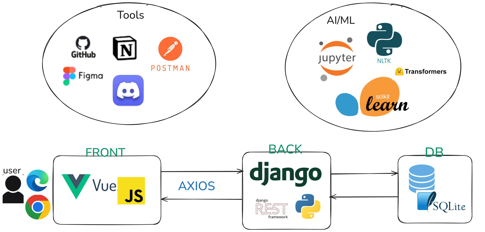

# [10-pjt] MoviENg: 사용자 언어 학습 레벨 맞춤 영화 추천 사이트

> ## 구미 2반 8팀 
### - 조장: 심순화 | 조원 박재영

### 업무 분담
- Back-end, DB 구축, 디자인 : 박재영
- Front-end, DB 구축, 디자인 : 심순화

* * *

> ## 프로젝트 기획서
## 1. 기획 배경
- 언어 학습을 위해서 해당 언어를 사용하는 영화나 미디어 자료를 사용하는 경우가 많음
- ott의 보편화로 어디서든 손쉽게 미디어에 접근이 가능함
- 하지만 언어 학습을 목적으로 ott를 사용하는 경우, 선택한 영화가 사용자의 외국어 실력에 부합하는지 알기 어려움
- 학습 난이도가 적절하지 않은 경우 학습 효과가 저하됨
- **다양한 ott 서비스를 구독하여 영화를 통해 언어 학습을 즐기는 사용자들을 위한 맞춤형 플랫폼의 필요성 발견**
## 2. 목표
- **목표 사용자**
    - `영화와 언어 학습을 결합`한 효과적인 학습 방법을 찾는 사용자
    - `ott 서비스 및 영화를 활용해 몰입형 학습`을 선호하는 학습자
## 3. 차별성
1. **시장 분석**
    - `ott 구독자 수와 언어 학습 시장의 지속적 성장`
    - `영화 콘텐츠와 AI를 활용한 언어 학습 서비스는 경쟁 시장에서의 차별화` 가능성
2. **사용자 체류 시간 증가**
    - 일반 영화 추천 서비스와는 다르게 `학습을 위한 단어장 기능을 추가하여 사용자가 페이지에 더 오래 체류`할 수 있도록 설계
3. **언어 학습 환경 제공**
    - **단어장**: 영화 대사나 제공되는 영화에 대한 정보를 단어장에 입력해 학습에 활용 가능
    - **챗봇**: 학습한 표현을 활용해 대화 연습이나, 문법 교정, 유사 표현 학습 등 다양하게 사용 가능한 AI 챗봇 제공
    - **경험치 및 티어 시스템 도입**: 사용자의 동기 부여와 흥미를 위한 학습 포인트 및 티어 시스템 도입
4. **커뮤니티 및 사용자 상호작용 강화**
    - **리뷰**: 해당 영화에 대한 리뷰를 통해 학습 경험 공유
    - **팔로잉 기능**: 팔로잉 기능 및 사용자 정보 제공으로 상호 교류와 동기 부여가 가능한 시스템
    - **단어장 공개 여부**: 단어장 공개 여부 설정으로 학습 자료 공유 또는 비공개 설정도 가능
## 4. 기술
### 4-1. NLP를 활용한 영화 레벨 분류
- 영화 스크립트 데이터와 해당 영화의 tmdb 데이터를 통해 NLP와 장르별 난이도 점수 시스템의 결합으로 영화 레벨을 분류함
    1. CEFR(국제 언어 평가 기준)에 맞추어 분류된 텍스트 데이터를 활용하여 MLP 모델에 지도 학습
    2. 영화 스크립트 데이터를 자연어 처리(NLP)하여 분류
    3. AI를 활용하여 분류된 데이터의 더 정밀한 분류를 위해서 장르별 난이도 선별

        | 점수 | 난이도          | 장르                                                    | 특징                                                                 |
        |------|---------------|-------------------------------------------------------|--------------------------------------------------------------------|
        | 1점   | 쉬운 장르       | Animation, Comedy, Family                            | 단순한 문장과 쉬운 주제를 가진 장르                              |
        | 2점   | 쉬운 장르       | Music, Romance, TV Movie                             | 다소 복잡한 감정 표현이 포함되지만 비교적 쉬운 대화                |
        | 3점   | 중간 난이도     | Action, Adventure, Fantasy                           | 동작과 모험 중심, 일부 기술적 용어 포함                            |
        | 4점   | 중간 난이도     | Crime, Drama, Horror, Mystery, Thriller, Western    | 심리적 대화, 갈등, 전문 용어 등이 포함되어 난이도가 중간 수준         |
        | 5점   | 어려운 장르     | Documentary                                          | 주제에 따라 전문적이고 어려운 용어 사용                             |
        | 6점   | 어려운 장르     | History, Science Fiction, War                       | 고급 어휘와 기술적/역사적 맥락 이해가 필요                          |

    4. 난이도 선별 후 점수 체계와 AI로 분류된 결과를 계산해 난이도 분류
### 4-2. ERD
[MoviENg ERD](https://www.erdcloud.com/d/gA4Pix2NoxgfkDP55)

### 4-3. 기술 스택
#### FrontEnd
- Javascript
- React
#### BackEnd
- Python 3
- Django
- Sqlite3
#### AI/ML
- PyTorch
- Transformers
- scikit-learn
- NLTK
#### Tools
- [Notion](https://romantic-blanket-13b.notion.site/1359cee60178808e99b9dcfee88d90e4?pvs=4)
- Postman
- Jupyter Notebook
- Figma
- GitHub/GitLab
- Discord
## 5. 서비스 아키텍쳐

## 6. 회고
- 순화: 처음으로 제대로 웹 페이지를 구상하고 개발했다. 기획과 요구사항 작성부터 실제 개발까지 내 손으로 만들어보니 신기했다. 처음에 입과했을 때를 생각해보니 정말 많이 성장했다는 생각이 들었다. 프론트 엔드를 담당하면서 axios 요청과 화면 컴포넌트 구성, js 사용과 json 데이터 활용 등 그간 수업과 실습에서 배운 것들로 최대한 할 수 있는 것들을 모두 구상해보고자했다. 구상한 것들이 잘 나올 때는 뿌듯했다. 처음 해보는 필터링, 검색 로직 같은 것들은 어렵지만 새로운 것을 배워간다는 생각이 들어서 무척 좋았다. 그리고 가장 크게 느낀 것은 예외 처리가 무척이나 중요하다는 점이다. 개발과 디버깅 과정에서 많은 버그들을 발견했고, 많은 경우의 수에 대비해서 예외 처리가 있어야 사용자에게 편의를 제공해줄 수 있다는 생각이 들었다. 웹 개발이 이만큼 발전했던 이유는 편리성 때문이라고 생각한다. 그래서 웹 개발과 디자인에서 중요한 요소 중 하나는 사용자 경험(UX)인 것 같다. 최대한 좋은 UX를 위해서 내가 실제로 사용한다고 생각하고 개발을 진행하였다. 어떤 부분들이 더 편리할지 고려하다 보니 꽤 많은 기능들이 구현되었고, 그 과정에서 많은 것들을 배울 수 있었다. 그리고 팀원과 협업하면서 처음부터 많은 의사소통을 했는데, 그 과정에서 효율적인 의사소통 방법을 배울 수 있었다. 그리고 즉각적인 피드백을 통해서 좀 더 원만하게 업무를 수행할 수 있었다.

- 재영: 처음 해 본 프로젝트였는데, 좋은 팀원을 만나 많은 것을 배울 수 있었다. 백엔드를 담당하여 처음으로 많은 데이터를 다뤄봤다. 내가 원하는 DB 구축을 위해 다양한 API 수집하고 데이터를 합쳐 원하는 데이터로 가공하는 법을 배웠다. 그동안 실습에서는 내가 만든 아주 작은 더미 데이터만 다뤘었는데 관통 프로젝트를 통해 16,000개 이상의 데이터를 다뤄볼 수 있었다. 이 과정에서 데이터가 많을 때 내가 설계한 로직이 올바른지 검토하는 샘플 데이터로 먼저 테스트해 보는 과정이 중요하다는 걸 경험했다. 또 백엔드에서 프론트에 필요한 데이터를 잘 필터링해 주면 프론트가 할 일이 조금이라도 줄어들어 팀 작업 효율을 높일 수 있다는 점을 경험하며, 다음 프로젝트에서는 필터링, 예외 처리를 백엔드에서 완벽하게 구현해 보고 싶다는 목표도 생겼다. 또 프론트에서 이러이러한 데이터가 더 필요해 하고 요청할 때, 그 데이터를 가공해 전달해 주는 과정이 뿌듯하고 즐거웠다. 
 최종 관통 프로젝트에서 가장 크게 깨달은 점은 문서화의 중요성이다. 좋은 팀원을 만나 처음부터 Git commit message, 회의록, ERD 작성, 요구사항 정의서 등을 체계적으로 준비하며 프로젝트의 기본을 다질 수 있었다. 프로젝트를 하면 할수록 왜 요구사항 명세서를 최대한 자세히 써야하는지, 모든 회의 들을 문서화 하는 작업이 얼마나 중요한지 깨달았다. 또 서로 요구사항 명세서, API 명세서를 보며 진척상황을 실시간으로 확인하고, 백로그를 점점 완성해 가는 작업이 성취감을 느꼈다. 꾸준한 회의와 문서화가 있어야 원하는 기능 구현을 다 해낼 수 있다는 걸 경험한 프로젝트였다.